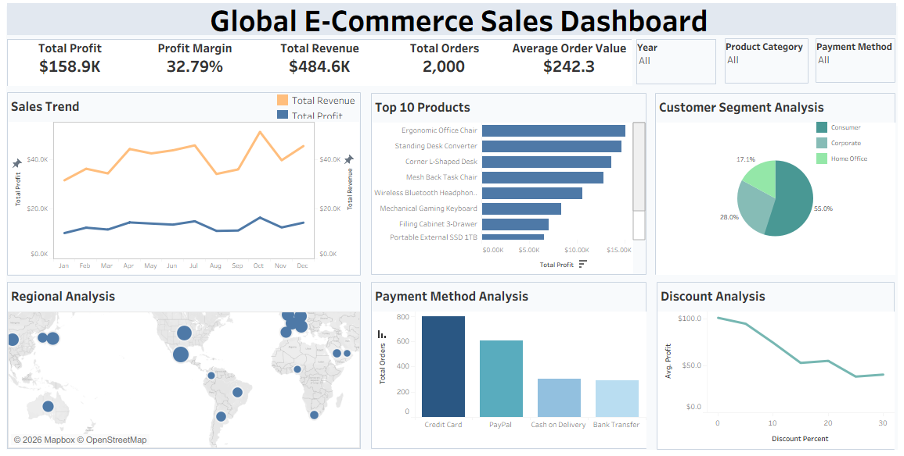

# E-Commerce Sales Performance Analysis

## Project Overview
This project analyzes global e-commerce sales data using SQL and Tableau to identify sales trends, product performance, customer segments, regional performance, and payment methods. The dashboard provides interactive visualizations to support business decision-making. The analysis was performed using SQL for data exploration and Tableau for interactive dashboard visualization.

---

## Business Questions

1.	How do monthly revenue and profit trends change over time?
2.	Which product contribute is the most profitable?
3.	Which customer segment is the most profitable?
4.	Which country generate the highest sales and profit?
5.	Which payment methods are most preferred by customers?
6.	How does profit vary across different discount levels?

---

## Tools Used

- SQL
- Tableau
---

## Dataset

- Total Records: 2,000
- Total Columns: 15
- Analysis Period: 2023–2025
- Source: https://www.kaggle.com/datasets/muhammadaammartufail/global-e-commerce-sales-and-customer-data 

---

## Dashboard Preview

---

## Tableau Public Dashboard

🔗 **Dashboard Link: https://public.tableau.com/app/profile/alya.izdihar4832/viz/ecommercesalesperformanceanalysisbyTableau/GlobalE-CommerceSalesDashboard?publish=yes&showOnboarding=true**

---
## Key Insights

- Total revenue reached **$484.6K**, generating a total profit of **$158.9K** with a **32.79% profit margin**.
- Sales and profit fluctuated throughout the analysis period, with the highest performance recorded in **October**.
- **Ergonomic Chair Office** was the most profitable product, generating the highest total profit.
- The **Consumer** segment contributed the largest share of total sales.
- **North America** generated the highest sales and profit among all regions.
- **Credit Card** was the most frequently used payment method.
- Higher discount levels generally resulted in lower average profit.

---

## Repository Contents

| File | Description |
|------|-------------|
| `README.md` | Project documentation and summary |
| `ecommerce sales performance analysis.sql` | SQL queries used for data exploration and analysis |
| `ecommerce_dashboard.twb` | Tableau workbook |
| `dashboard.png` | Dashboard preview image |

## Business Recommendations

- Optimize sales strategies by using **October's** strong performance as a reference for improving sales during lower-performing months.
- Prioritize high-profit products by optimizing promotional efforts and ensuring product availability.
- Continue prioritizing marketing strategies and promotional campaigns for the **Consumer** segment to maintain its contribution to overall sales.
- Use **Mexico** as a benchmark market to identify successful sales strategies that can be applied in lower-performing countries.
- Collaborate with payment providers to offer attractive payment incentives and encourage customer transactions.
- Implement targeted discount strategies while setting appropriate discount limits to maintain profitability.
