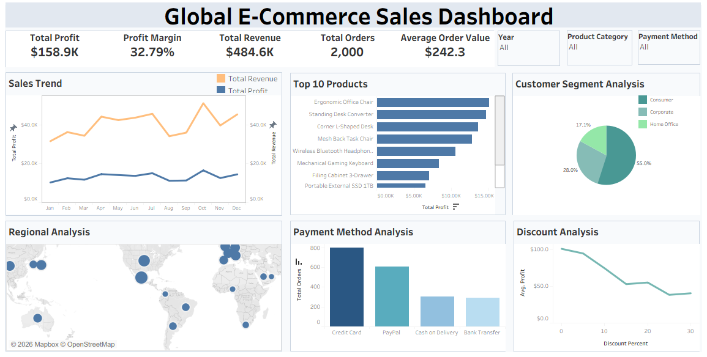

# E-Commerce Sales Performance Analysis

## Project Overview

This project analyzes global e-commerce sales data using SQL and Tableau to identify the key factors affecting sales and profitability. The analysis provides data-driven insights and business recommendations to support decision-making and improve overall business performance through a dashboard.

---

## Business Questions

1.	How do monthly revenue and profit trends change over time?
2.	Which product generates the highest profit?
3.	Which customer segment is the most profitable?
4.	Which country generate the highest sales and profit?
5.	Which payment methods are most preferred by customers?
6.	How does profit vary across different discount levels?

---

## Tools Used

- SQL
- Tableau
  
---

## Dataset

- Total Records: 2,000
- Total Columns: 15
- Analysis Period: 2023–2025
- Source: https://www.kaggle.com/datasets/muhammadaammartufail/global-e-commerce-sales-and-customer-data 

---

## Dashboard Preview

---

## Tableau Public Dashboard

🔗 **Dashboard Link: https://public.tableau.com/app/profile/alya.izdihar4832/viz/ecommercesalesperformanceanalysisbyTableau/GlobalE-CommerceSalesDashboard?publish=yes&showOnboarding=true**

---

## Key Insights

- Total revenue reached **$484.6K**, generating a total profit of **$158.9K** with a **32.79% profit margin**.
- Sales and profit fluctuated throughout the analysis period, with the highest performance recorded in **October**.
- **Ergonomic Chair Office** was the most profitable product, generating the highest total profit.
- The **Consumer** segment contributed the highest profit.
- **Mexico** in the **North America** region generated the highest profit.
- **Credit Card** was the most frequently used payment method.
- Higher discount levels were associated with lower average profit
  
---

## Business Recommendations

- Revenue and profit reached their highest levels in **October**. The company can evaluate the sales activities during this period and use them as a reference when planning sales strategies for months with lower performance.
- Ergonomic Office Chair generated the highest profit contribution. The company can prioritize high-profit products by optimizing promotions, improving inventory management, and ensuring product availability to maximize profitability.
- The **Consumer** segment contributed the highest profit among all customer segments. Prioritize marketing strategies and promotional campaigns for the Consumer segment to maintain its contribution to overall profitability.
- **Mexico** in the North America region generated the highest profit contribution. The company can use this market as a benchmark by optimizing promotions and ensuring the availability of top-performing products. These strategies can then be adapted to regions with lower profitability.
- Credit Card was the most frequently used payment method. The company can collaborate with banks or payment providers to offer cashback, reward points, or 0% installment plans to increase transactions and maintain customer preference for this payment method.
- The analysis shows that higher discount rates are associated with lower average profit. Therefore, the company can implement a targeted discount strategy by offering discounts only for selected products, customer segments, or promotional periods. In addition, setting a maximum discount limit can help attract customers while maintaining profitability.
  
---

## Repository Contents

| File | Description |
|------|-------------|
| `README.md` | Project documentation and summary |
| `ecommerce sales performance analysis.sql` | SQL queries used for data exploration and analysis |
| `ecommerce dashboard.twb` | Tableau workbook |
| `dashboard.png` | Dashboard preview image |
